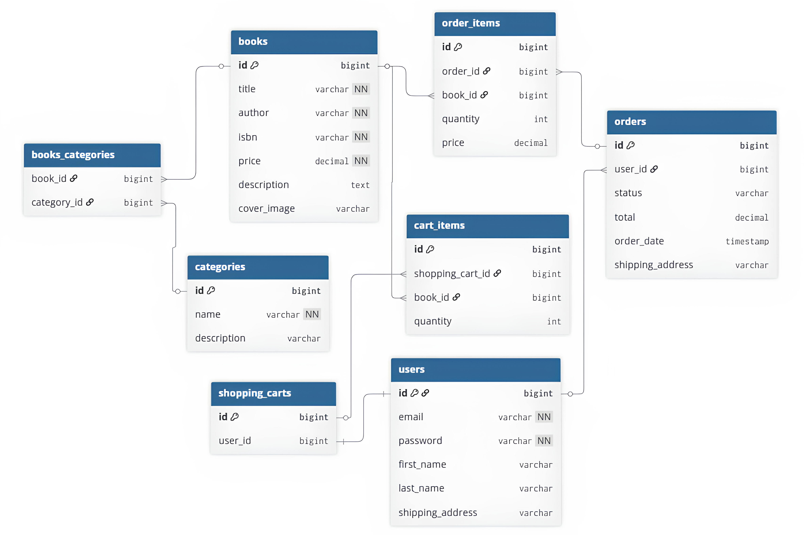

# 🚀 BookFlow – RESTful Backend API for Book Store


BookFlow is a modern, scalable RESTful API designed for e-commerce book platforms.
It handles the complete lifecycle of online sales: from secure stateless authentication to complex automated order processing.

This project showcases a production-ready backend built with stateless JWT authentication, role-based access control, and a well-structured layered architecture. It relies on Spring Data JPA for data access and Liquibase for database versioning.

---

## 📍 Table of Contents
- [🛠️ Tech Stack](#️-tech-stack)
- [🔥 Features](#-features)
- [🧱 Architecture](#-architecture)
- [🧩 Domain Model](#-domain-model)
- [🔐 Security](#-security)
- [📡 API Endpoints](#-api-endpoints)
- [🔄 Example Workflow](#-example-workflow)
- [🎬 Video Demo](#-example-workflow)
- [📖 API Documentation](#-api-documentation)
- [🚀 How to Run](#-how-to-run-the-project)

---

## 🛠️ Tech Stack

| Layer              | Technology                    |
|--------------------|-------------------------------|
| Language           | Java 17                       |
| Framework          | Spring Boot                   |
| Security           | Spring Security + JWT         |
| Web                | Spring Web (REST API)         |
| Data Access        | Spring Data JPA + Hibernate   |
| Database           | MySQL                         |
| In-Memory Database | H2                            |
| Migrations         | Liquibase                     |
| Mapping            | MapStruct                     |
| Validation         | Spring Validation             |
| API Documentation  | SpringDoc OpenAPI (SwaggerUI) |
| Testing            | JUnit 5, Mockito              |
| Containerization   | Docker                        |

### [⬆ Back to Table of Contents](#-table-of-contents)

## 🔥 Features

- 🔐 JWT-based authentication (stateless)
- 👥 Role-based access control (USER / ADMIN)
- 📚 Full CRUD for books and categories
- 🛒 Shopping cart management
- 📦 Order creation and tracking
- 🔎 Pagination, filtering, and search
- 📄 Swagger API documentation
- 🐳 Docker support

### [⬆ Back to Table of Contents](#-table-of-contents)

## 🧱 Architecture

The project follows a layered architecture:

### Controller → Service → Repository → Database


### Key principles:
- Clear separation of concerns
- DTO layer instead of exposing entities to client
- MapStruct for mapping
- Low coupling between layers

### [⬆ Back to Table of Contents](#-table-of-contents)

---

## 🧩 Domain Model

### Core entities:

- User
- Book
- Category
- ShoppingCart
- CartItem
- Order
- OrderItem

### Relationships:
- User & ShoppingCart: ```One-to-One``` (Each user has a dedicated cart)
- ShoppingCart & CartItem: ```One-to-Many``` (A cart can hold multiple items)
- User & Order: ```One-to-Many``` (One user can have an extensive order history)
- Order & OrderItem: ```One-to-Many``` (Each order tracks specific books and quantities)
- Book & Category: ```Many-to-Many``` (A book can belong to multiple genres, e.g., "Fantasy" and "Bestseller")

## Database Relationship Diagram



### [⬆ Back to Table of Contents](#-table-of-contents)

---

## 🔐 Security

- JWT authentication
- Stateless session management
- Password hashing with BCrypt
- Custom UserDetailsService
- Method-level security with `@PreAuthorize`

### [⬆ Back to Table of Contents](#-table-of-contents)

---

## 📡 API Endpoints

| Endpoints                  | HTTP Method | Description                                   | Authentication |
|:---------------------------|-------------|-----------------------------------------------|----------------|
| 🔐 **Authentication**      |             |                                               |                |
| `/auth/registration`       | POST        | Create a new user account                     | None           |
| `/auth/login`              | POST        | User login and receive JWT token              | None           |
| 📚 **Book management**     |             |                                               |                |
| `/books`                   | GET         | Get all books (with pagination)               | User / Admin   |
| `/books/{id}`              | GET         | Get a book by ID                              | User / Admin   |
| `/books/{id}`              | PUT         | Update a book by ID                           | **ADMIN**      |
| `/books/{id}`              | DELETE      | Delete a book by ID                           | **ADMIN**      |
| `/books/search`            | GET         | Search for books based on parameters          | User / Admin   |
| 📂 **Category management** |             |                                               |                |
| `/categories`              | GET         | Get all categories (with pagination)          | User / Admin   |
| `/categories/{id}`         | GET         | Get a category by ID                          | User / Admin   |
| `/categories/{id}/books`   | GET         | Get books by category ID                      | User / Admin   |
| 🛒 **Cart management**     |             |                                               |                |
| `/cart`                    | POST        | Add book to shopping cart                     | User           |
| `/cart/items/{id}`         | PUT         | Update the quantity of books in shopping cart | User           |
| `/cart/items/{id}`         | DELETE      | Delete a book from shopping cart              | User           |
| 📦 **Order management**    |             |                                               |                |
| `/orders`                  | POST        | Create a new order                            | User           |
| `/orders/{id}`             | GET         | Get an order by ID                            | User           |
| `/orders/{id}/items`       | GET         | Get all items in an order                     | User           |
| `/orders/{id}`             | PATCH       | Update order status (ADMIN)                   | **ADMIN**      |

### [⬆ Back to Table of Contents](#-table-of-contents)

---

## 🔄 Example Workflow

1. Register a new user
2. Login and receive JWT token
3. Fetch books list
4. Add a book to the cart
5. Place an order
6. View order history

### You can see the full API workflow below ↓

- **[Watch the project demo (2 min)](https://www.youtube.com/watch?v=N67Zncj7lyY)**

### [⬆ Back to Table of Contents](#-table-of-contents)

---

## 📖 API Documentation

- After starting the application:


http://localhost:8088/swagger-ui/index.html


- OpenAPI spec:

http://localhost:8088/v3/api-docs

### [⬆ Back to Table of Contents](#-table-of-contents)

---

## 🚀 How to Run the Project

### **Step 1️⃣: Clone the repository**
```bash
git clone https://github.com/rmaksym1/bookflow-api.git
cd bookflow-api
```

### **Step 2️⃣: Configure environment variables**
Create a .env file in the root directory based on .env.example.

Example:
```bash
# MySQL Database Configuration
MYSQLDB_ROOT_PASSWORD=db_password
MYSQLDB_USERNAME=db_username
MYSQLDB_DATABASE=db_name
MYSQLDB_LOCAL_PORT=3307  # Connect here if using a local DB client
MYSQLDB_DOCKER_PORT=3308 

# Spring Boot Configuration
SPRING_LOCAL_PORT=8080   # The app will be available at this port
SPRING_DOCKER_PORT=8088

# Security Configuration
JWT_EXPIRATION=300000
JWT_SECRET=bookstoreproject1234567890wwwwww

# Debugging
DEBUG_PORT=5005
```
**Fill in the values according to your local MySQL setup and desired Spring Boot port.**

⚠️ **IMPORTANT:** 

If you are running the app inside Docker, your SPRING_DATASOURCE_URL in application.yml (or environment variables) should point to the database container name (usually db or mysql) and use the internal port (3306 or whatever is set in your compose file), not localhost.

### **Step 3️⃣: Build and start containers**
### 🐳 With Docker
```bash
docker-compose up --build
```
This command will:
- Build the Spring Boot application Docker image
- Start MySQL container
- Start the application container
- Apply Liquibase database migrations automatically

Now app is available on:
```
http://localhost:8088
```

### **Step 4️⃣: Stop containers**
```bash
docker-compose down
```

### ⚙️ Without Docker

If you prefer running locally:
1. Start MySQL manually
2. Create a database
3. Update application.yml with local database credentials
4. Run the following commands:
```bash
mvn clean install
mvn spring-boot:run
```

### [⬆ Back to Table of Contents](#-table-of-contents)